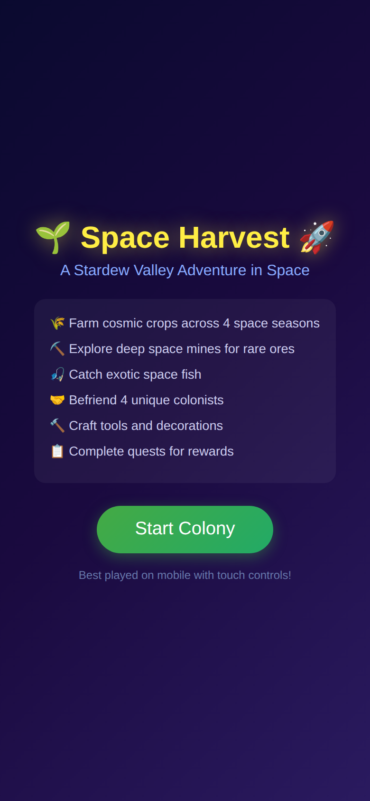
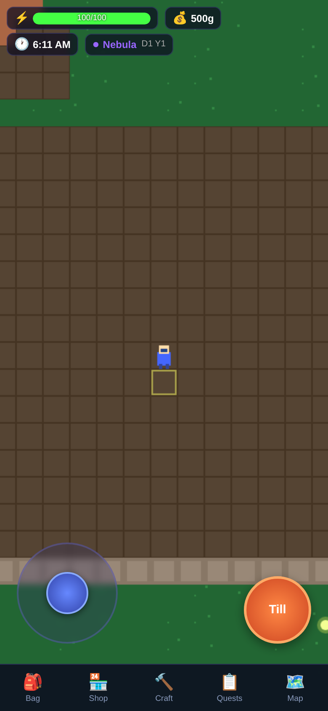
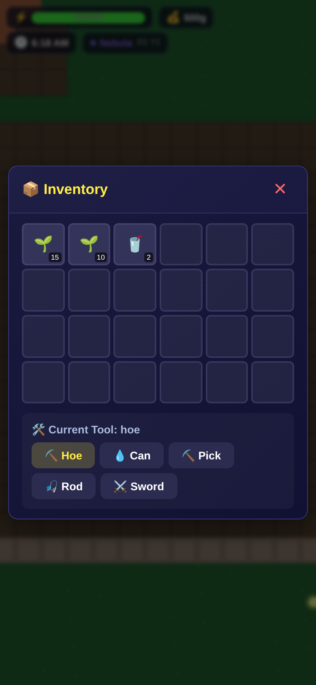
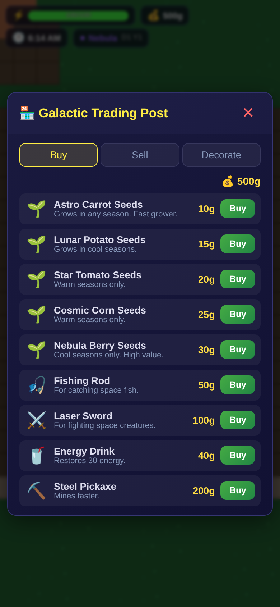
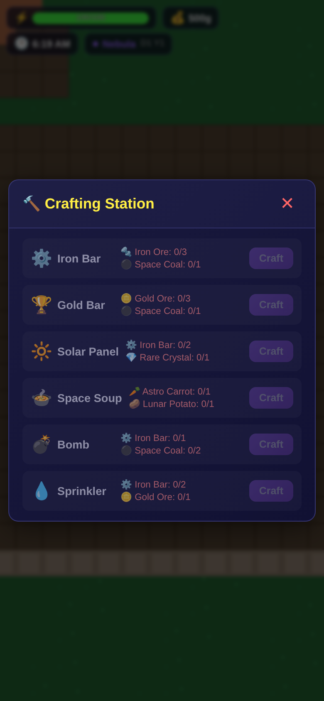
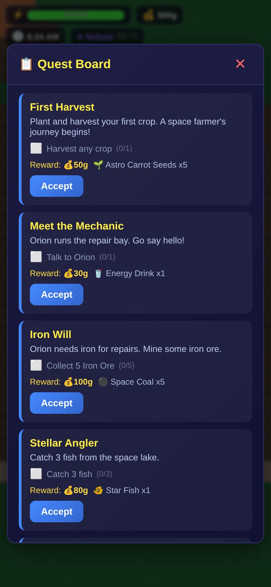
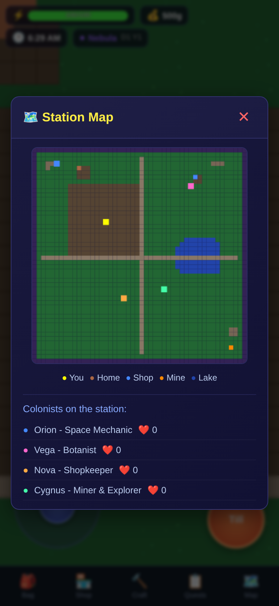
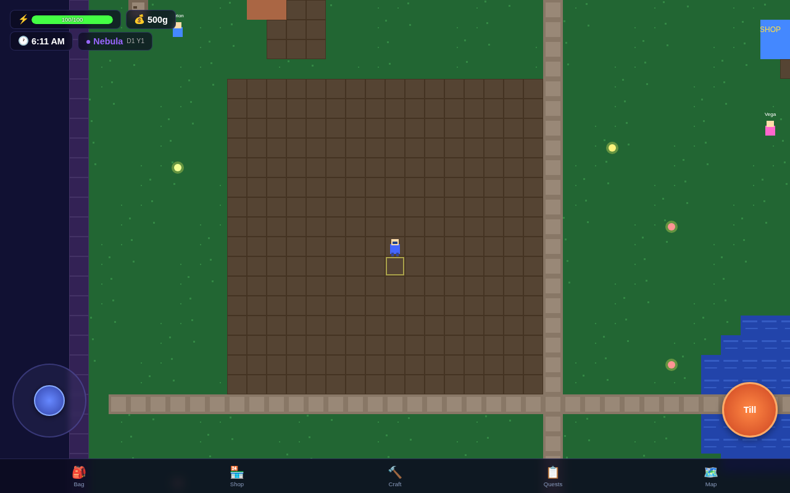
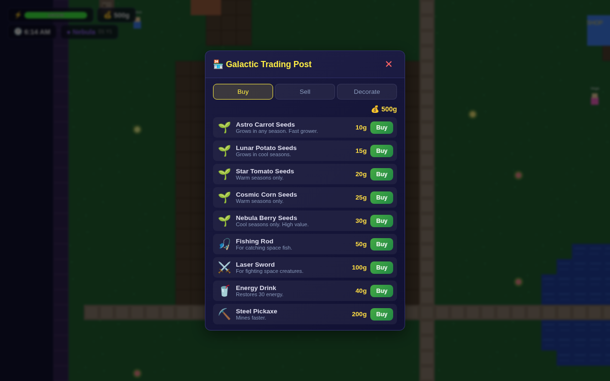

# 🚀 Space Harvest

A complete Stardew Valley clone set in space — built with React, Vite, and HTML5 Canvas. Mobile-first with full touch controls.

**Play now:** https://newstex-sparky.github.io/space-acccloned-games-typegpu/

## Features

### 🌾 Farming
- Till soil, plant seeds, water crops, and harvest
- 5 crop types: Astro Carrots, Lunar Potatoes, Star Tomatoes, Cosmic Corn, Nebula Berries
- Crops grow over multiple in-game days
- Water daily for faster growth

### ⛏️ Mining
- Enter the space mines and break rocks
- Find ores: Iron, Gold, Rare Crystals
- Fight space creatures with your Laser Sword
- Deeper levels = rarer ores

### 🎣 Fishing
- Cast your line into space lakes
- Catch 4 exotic fish species
- Mini-game with timing-based catching
- Sell fish for profit

### 🍃 Foraging
- Wild items spawn on the map daily
- Free resources for crafting and selling

### 🤝 NPCs
- 4 unique colonists with dialog and friendship hearts
- **Orion** — Space Mechanic
- **Vega** — Botanist
- **Nova** — Shopkeeper
- **Cygnus** — Miner & Explorer
- Give gifts to increase friendship

### 🏪 Shop
- Buy seeds, tools, and upgrades
- Sell crops, fish, and ores for profit
- Buy decorations for your farm

### ⚡ Energy System
- Every action consumes energy
- Sleep to restore energy fully
- Pass out if energy hits 0

### 🌅 Day/Night Cycle
- Time progresses from 6AM to 2AM
- Must sleep before 2AM or pass out
- 4 space seasons: Nebula, Aurora, Solar, Frost
- Each season affects which crops grow

### 🔨 Crafting
- 6 recipes: Iron Bar, Gold Bar, Solar Panel, Space Soup, Bomb, Sprinkler
- Craft from gathered materials

### 📋 Quests
- 8 quests with objectives and rewards
- Quest board tracks progress
- Earn gold, seeds, and items

### 🏠 Building & Decoration
- 6 placeable decorations: House, Fence, Lamp, Solar Panel, Antenna, Garden Gnome

### 🎮 Game Controller Support
- Play with USB game controllers
- Includes button mapping and vibration feedback

### 📱 Mobile Controls

| Control | Action |
|---------|--------|
| Left joystick | Move character |
| Right action button | Context-sensitive: Till / Plant / Water / Harvest / Mine / Fish / Talk |
| Bottom nav: 🎒 Bag | Open inventory |
| Bottom nav: 🏪 Shop | Open shop |
| Bottom nav: 🔨 Craft | Open crafting station |
| Bottom nav: 📋 Quests | Open quest board |
| Bottom nav: 🗺️ Map | View station map |

## Screenshots

### Mobile

**Start Screen**


**Main Gameplay — Touch controls, HUD, tile world**


**Inventory — 24-slot grid with tool selection**


**Shop — Galactic Trading Post (Buy/Sell/Decorate)**


**Crafting Station — 6 recipes**


**Quest Board — Objectives, progress, rewards**


**Station Map — NPC locations & friendship**


### Desktop

**Desktop Gameplay**


**Desktop Shop**


## Tech Stack

- **React 18** — UI overlays, modals, HUD
- **Vite 5** — Build tooling, dev server
- **HTML5 Canvas** — Game world rendering (48×48 tilemap)
- **TypeScript** — Type-safe engine and components
- **Game Controller API** — USB game controller support
- **GitHub Actions** — Auto-deployment to GitHub Pages

## Development

```bash
npm install
npm run dev      # Start dev server at localhost:8001
npm run build    # Production build to dist/
npm run preview  # Preview production build
npm run test     # Run unit tests with Vitest
npm run deploy   # Deploy to GitHub Pages
```

## Deployment

Pushes to `main` automatically trigger the GitHub Actions workflow which builds and deploys to GitHub Pages.

**Live URL:** https://newstex-sparky.github.io/space-acccloned-games-typegpu/